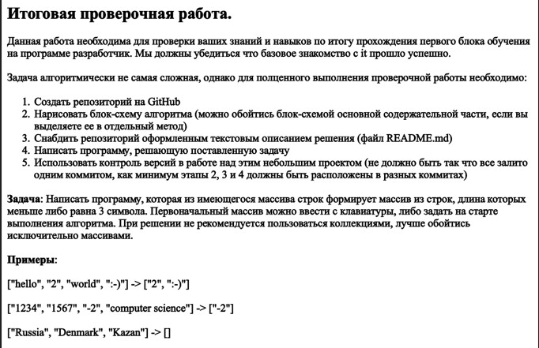

# Project description

* Current repository is a student's test work
* Course developer on GeekBrains
* Made by Maria Pechenkina

# Task 

# About the project

* blockdiagram.drawio - description of the main method
* Program.cs - solution for array containing 5 elements, keyboard input, console output